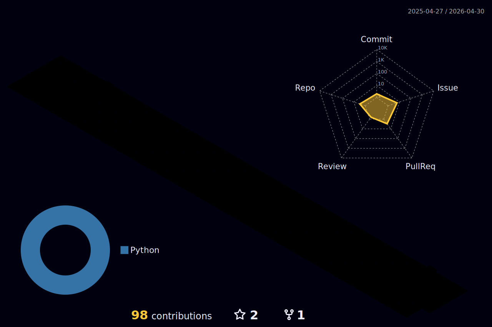

### Hi there 👋

- 🔭 At the moment, I am working as a machine learning systems engineer in the AI industry.
- 🌱 I'm currently exploring Efficient Deep Learning Computing and actively contributing to AI & data infrastructure development.

#### My profile

#### My activity

<!--
**hoangvictor/hoangvictor** is a ✨ _special_ ✨ repository because its `README.md` (this file) appears on your GitHub profile.

Here are some ideas to get you started:

- 🔭 I’m currently working on ...
- 🌱 I’m currently learning ...
- 👯 I’m looking to collaborate on ...
- 🤔 I’m looking for help with ...
- 💬 Ask me about ...
- 📫 How to reach me: ...
- 😄 Pronouns: ...
- ⚡ Fun fact: ...
-->

#### Contact

Please feel free to get in touch, I'll be happy to help!

